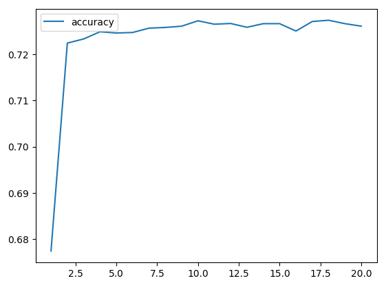

# BootCamp_deep-learning-challenge

## Analysis Report

### Overview of the analysis:

The purpose of this analysis is to create a binary classifier using deep learning techniques to predict the success of organisations/entities funded by Alphabet Soup. The dataset provided contains information about various organisations, and the goal is to train a model that can effectively determine whether the funding provided was successful or not.

### Results:

1. Data Preprocessing:
   - What variable(s) are the target(s) for your model?

        ```python
        y = numeric_df["IS_SUCCESSFUL"].values
        ```

   - What variable(s) are the features for your model?
   
        ```python
        X = numeric_df.drop(["IS_SUCCESSFUL"],1).values
        ```
        
   - What variable(s) should be removed from the input data because they are neither targets nor features?

        ```python
        application_df = application_df.drop(columns=["EIN","NAME"])
        ```
        

2. Compiling, Training, and Evaluating the Model:
   - How many neurons, layers, and activation functions did you select for your neural network model, and why?
        
        A function was created which creates a new Sequential model with hyperparameter options, allowing kerastuner to decide which activation function to use in hidden layers along with the number of hidden layers and neurons in hidden layers for the 37 features in the data set. kerastuner search was used to identify the top 3 model hyperparameters.

        The model's training results for the top three hyperparameters are as follows:

        1. Hyperparameters: {'activation': 'tanh', 'first_units': 5, 'num_layers': 6, 'units_0': 1, 'units_1': 5, 'units_2': 7, 'units_3': 3, 'units_4': 9, 'units_5': 3, 'tuner/epochs': 20, 'tuner/initial_epoch': 7, 'tuner/bracket': 1, 'tuner/round': 1, 'tuner/trial_id': '0046'}

            Loss: 0.5598
            
            Accuracy: 0.7322

        2. Hyperparameters: {'activation': 'tanh', 'first_units': 7, 'num_layers': 6, 'units_0': 9, 'units_1': 5, 'units_2': 1, 'units_3': 9, 'units_4': 7, 'units_5': 9, 'tuner/epochs': 20, 'tuner/initial_epoch': 0, 'tuner/bracket': 0, 'tuner/round': 0}
            
            Loss: 0.5549

            Accuracy: 0.7311

        3. Hyperparameters: {'activation': 'tanh', 'first_units': 7, 'num_layers': 3, 'units_0': 1, 'units_1': 7, 'units_2': 3, 'units_3': 5, 'units_4': 1, 'units_5': 7, 'tuner/epochs': 20, 'tuner/initial_epoch': 7, 'tuner/bracket': 2, 'tuner/round': 2, 'tuner/trial_id': '0039'}
            
            Loss: 0.5571

            Accuracy: 0.7311
        


   - Were you able to achieve the target model performance?

        Based on the provided results, the overall accuracy of the model is approximately 73%. While this accuracy may be acceptable depending on the application, it's worth exploring alternative models and hyperparameters to improve performance.


   - What steps did you take in your attempts to increase model performance?
        
        The following steps, in addition to the original data processing steps and the use of kerastuner in making decisions around the model parameters, were taken to reduce features and bin values in some columns:

        ```python
        # Choose a cutoff value and create a list of affiliation types to be replaced
        # use the variable name "affiliation_types_to_replace"
        affiliation_types_to_replace = list(aff_counts[aff_counts<100].index)

        # Replace in dataframe
        for aff in affiliation_types_to_replace:
            application_df['AFFILIATION'] = application_df['AFFILIATION'].replace(aff,"Other_Affiliation")

        # Check to make sure binning was successful
        application_df['AFFILIATION'].value_counts()
        ```

        ```python
        # create a function to bin INCOME_AMT
        def encode_income(value):
            """
            This function encodes INCOME_AMT by setting 0 as 0 and any income as 1.
            """
            if value == '0':
                return 0
            else:
                return 1

        # Call the encode_income function on the INCOME_AMT column
        application_df['INCOME_AMT'] = application_df['INCOME_AMT'].apply(encode_income)
        application_df.head()
        ```

### Summary

The deep learning model was built with the following architecture and hyperparameters resulting in the overall accuracy of approximately 73%:

&emsp;**Activation Function:** Tanh

&emsp;**Number of Layers:** 6

&emsp;**Units in Each Layer:** [1, 5, 7, 3, 9, 3] for the first to sixth layers, respectively

&emsp;**Number of Epochs:** 20



#### Recommendation:

Consider using a Random Forest Classifier for this classification problem. Random Forests are robust, easy to use, and less prone to overfitting compared to deep learning models. They also perform well with tabular data and can handle a mix of numerical and categorical features effectively.

#### Explanation:

**Interpretability:** Random Forests provide feature importance, aiding in understanding which features contribute most to the prediction. This can offer valuable insights for Alphabet Soup's decision-making process.

**Ensemble Learning:** Random Forests are an ensemble of decision trees, combining multiple models to improve overall performance and generalization.

**Less Sensitivity to Hyperparameters:** Random Forests are less sensitive to hyperparameter choices compared to deep learning models. They often perform well with default settings.

**Handling of Categorical Data:** Random Forests naturally handle categorical features without the need for extensive preprocessing, making them suitable for datasets with diverse types of information.

#### Conclusion:
While the deep learning model achieved a reasonable accuracy, adjusting the features through binning and other consolidation activities along with trialling different hyperparameters had very little effect on the overall accuracy.  Exploring alternative models such as Random Forests may provide Alphabet Soup with a more interpretable and potentially equally effective solution. Further hyperparameter tuning and feature engineering can still be explored to enhance the deep learning model's performance.